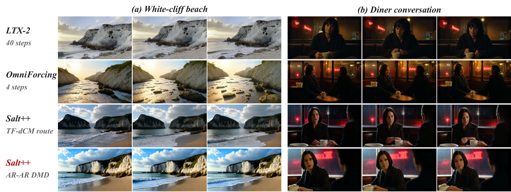
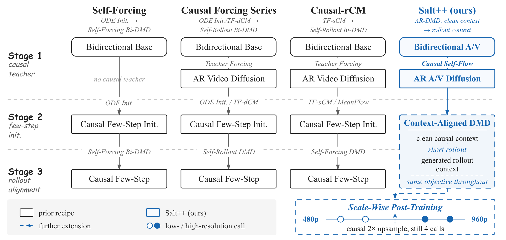
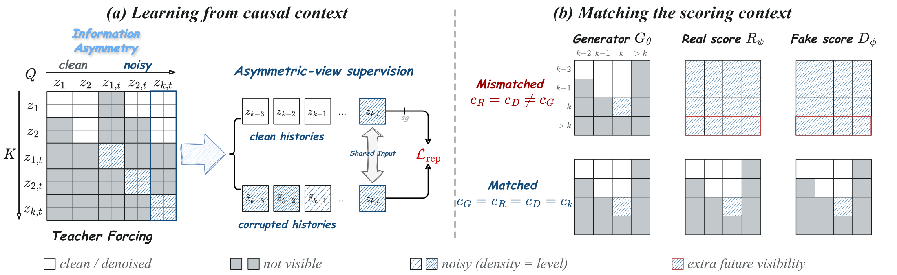
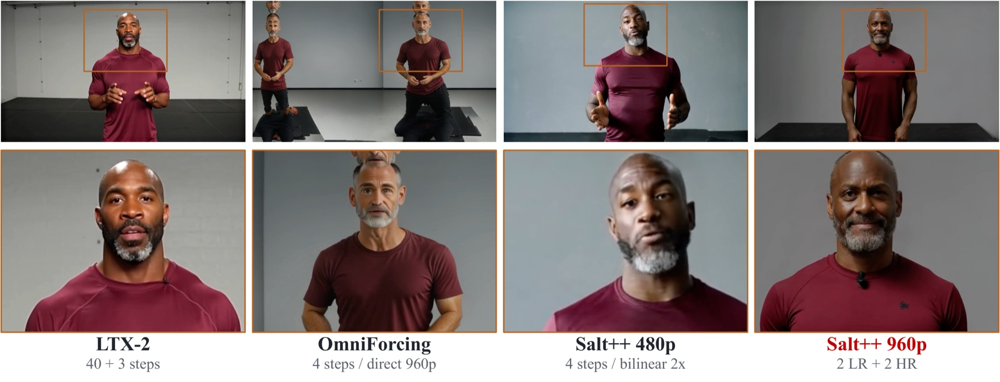

# 🧂 Salt++: Context-Aligned Post-Training for Few-Step Streaming Multimodal Generation

[](https://arxiv.org/abs/2609.36995)
[](https://arxiv.org/pdf/2609.36995)
[](https://xingtongge.github.io/Saltpp/)

Xingtong Ge<sup>1,2</sup>, Yutong Wang<sup>3</sup>, Lunjie Zhu<sup>1</sup>, Haitao Lin<sup>4</sup>, Fangyu Lin<sup>1</sup>, Yushi Huang<sup>1</sup>, Xin Zhang<sup>2</sup>, Yi Zhang<sup>2</sup>, Yu Liu<sup>2</sup>, Jun Zhang<sup>1</sup>

<sup>1</sup>The Hong Kong University of Science and Technology, <sup>2</sup>Vivix Group Limited, <sup>3</sup>The University of Sydney, <sup>4</sup>Westlake University

Preprint, 2026

> A successor to [Salt](https://github.com/XingtongGe/Salt), extending few-step
> distribution matching from video distillation to causal joint audio–video
> generation.

## 📝 Abstract

Few-step streaming audio–video generation requires both causal modeling and step
distillation, yet standard training recipes face two context-related challenges.
Teacher forcing pairs clean history with a noisy target, but supervises
predictive contextual representations only indirectly through velocity
prediction. Meanwhile, directly reusing bidirectional score models in causal
Distribution Matching Distillation (DMD) creates a mismatch between generation
and scoring contexts. We address these challenges with **Salt++**, a two-stage
post-training framework comprising Causal Self-Flow (CSF) and context-aligned
autoregressive DMD. CSF exploits contextual information asymmetry by varying the
history while keeping the noisy target fixed: a noise-mixed-history student
aligns its intermediate representations with those of a clean-history
exponential-moving-average teacher. This self-supervised signal encourages the
student to extract semantic information and improves cross-modal alignment.
Context-aligned AR DMD shares the causal mask and prefix across generator
sampling, fake-score training, and real-score evaluation to match generated and
reference distributions under a block-conditional KL objective. With calibrated
teacher guidance, it performs clean-prefix few-step distillation and then adapts
to generated histories without switching objectives or requiring separate
consistency distillation. At 480p, Salt++ improves visual and motion quality by
57% and 45% over OmniForcing on JavisBench under the same 4-step causal setting.
A separate scale-wise post-training stage extends Salt++ to 4-step 1664×960
generation, outperforming bidirectional LTX-2 on six of seven reported metrics.



*Four-step streaming audio–video generation at 480p. Salt++ retains scene and
facial detail that the causal baseline loses at the same step budget.*

🔊 **[Watch the generated clips with audio on the project page.](https://xingtongge.github.io/Saltpp/)**
Audio and video are generated jointly, so audio–visual synchrony can be judged
directly.

## ✅ TODO List

- [x] Paper on arXiv
- [x] Project page with audio–video samples
- [ ] Inference scripts
- [ ] Open-source model weights
- [ ] Training scripts

Stay tuned 🚀

## 🔍 Method



Prior recipes switch objectives between stages and score the causal generator
with bidirectional models. Salt++ keeps a single AR DMD objective throughout
post-training and only shifts its conditioning from clean context to generated
rollout:

1. **Causal Self-Flow (CSF)** varies the history while holding the noisy target
   fixed, turning contextual information asymmetry into a representation-learning
   signal for the autoregressive teacher.
2. **Context-aligned AR DMD** shares one causal mask and prefix across generator
   sampling, fake-score training, and real-score evaluation, so distribution
   matching alone suffices — no separate consistency-distillation stage.
3. **Scale-wise post-training** extends the recipe to 1664×960 with two
   low-resolution and two high-resolution generator calls per block, still four
   generator calls in total.



*Two roles of causal context in post-training. **(a)** CSF exploits information
asymmetry in causal histories for self-supervised representation learning.
**(b)** Mismatched (top) and aligned (bottom) contexts across the generator,
real score, and fake score.*

## 📈 Results

### Table 1: JavisBench-mini, 480p audio–video generation

**Bold** = best, <u>underline</u> = second best among the 4-step rows.

| Model | Causal | Steps | VQ ↑ | MQ ↑ | AQ ↑ | CLIP ↑ | IB-AV ↑ | Javis ↑ | DeSync ↓ |
|:--|:--:|:--:|--:|--:|--:|--:|--:|--:|--:|
| LTX-2 Base | ✗ | 40 | 1.884 | 0.566 | 4.986 | 0.311 | 0.239 | 0.200 | 0.608 |
| AR Teacher (CSF) | ✓ | 40 | 2.304 | 0.857 | 4.565 | 0.316 | 0.202 | 0.162 | 0.746 |
| OmniForcing | ✓ | 4 | 1.807 | 0.699 | 4.718 | 0.303 | 0.163 | 0.124 | <u>0.745</u> |
| Salt++ (TF-dCM route) | ✓ | 4 | <u>2.013</u> | <u>0.826</u> | <u>4.976</u> | <u>0.313</u> | **0.229** | **0.185** | **0.710** |
| **Salt++** | ✓ | 4 | **2.838** | **1.010** | **4.991** | **0.316** | <u>0.184</u> | <u>0.146</u> | 0.759 |

### Table 2: VBench video fidelity and temporal consistency, 480p

| Model | Causal | Steps | Aesthetic ↑ | Imaging ↑ | Subject Consistency ↑ | Background Consistency ↑ |
|:--|:--:|:--:|--:|--:|--:|--:|
| LTX-2 Base | ✗ | 40 | 53.89 | 67.06 | 95.94 | 95.63 |
| OmniForcing | ✓ | 4 | **56.74** | <u>68.41</u> | <u>96.62</u> | 95.32 |
| Salt++ (TF-dCM route) | ✓ | 4 | 53.65 | 62.87 | 96.58 | <u>96.05</u> |
| **Salt++** | ✓ | 4 | <u>55.43</u> | **69.98** | **97.01** | **96.24** |

### Table 3: JavisBench-mini, 1664×960 audio–video generation

**Bold** = best across all methods.

| Model | Causal | Steps | VQ ↑ | MQ ↑ | AQ ↑ | CLIP ↑ | IB-AV ↑ | Javis ↑ | DeSync ↓ |
|:--|:--:|:--:|--:|--:|--:|--:|--:|--:|--:|
| LTX-2 Base | ✗ | 40 + 3 | 2.231 | 0.607 | 4.867 | 0.311 | 0.169 | 0.145 | **0.658** |
| OmniForcing | ✓ | 4 | 2.298 | 0.832 | 4.721 | 0.293 | 0.165 | 0.128 | 0.755 |
| **Salt++** | ✓ | 4 | **2.730** | **0.957** | **5.113** | **0.318** | **0.193** | **0.157** | 0.768 |



*Scale-wise post-training at 1664×960, using two low-resolution and two
high-resolution generator calls per block.*

## 📚 Citation

If you find this work useful, please cite:

```bibtex
@misc{ge2026saltpp,
  title={Salt++: Context-Aligned Post-Training for Few-Step Streaming Multimodal Generation},
  author={Ge, Xingtong and Wang, Yutong and Zhu, Lunjie and Lin, Haitao and Lin, Fangyu and Huang, Yushi and Zhang, Xin and Zhang, Yi and Liu, Yu and Zhang, Jun},
  year={2026},
  eprint={2609.36995},
  archivePrefix={arXiv},
  primaryClass={cs.CV},
  url={https://arxiv.org/abs/2609.36995}
}
```

## 🙏 Acknowledgements

This work builds on [LTX-2](https://github.com/Lightricks/LTX-2) as the
bidirectional audio–video foundation model, follows the causal streaming setup
of OmniForcing, and evaluates with
[JavisBench](https://github.com/JavisVerse/JavisDiT) and
[VBench](https://github.com/Vchitect/VBench). Please also cite the original
projects when using their components.
